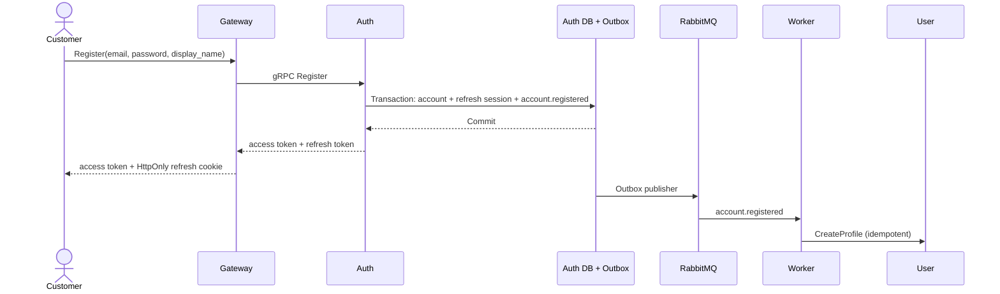
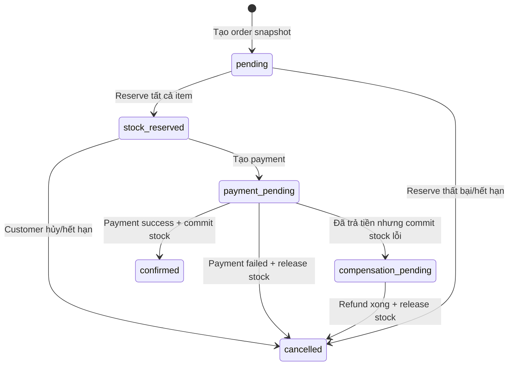

# Luồng nghiệp vụ

## Đăng ký và tạo profile bất đồng bộ

Điểm nghiệp vụ: account có thể đăng ký thành công trước khi profile xuất hiện trong khoảng thời gian ngắn. Event phải được retry, không rollback account sau khi HTTP đã trả thành công.

## Đăng nhập social

1. Frontend yêu cầu `provider-state` với provider và cờ `create_account`.
2. Gateway đặt state đối chiếu trong cookie HttpOnly, sống ngắn hạn.
3. Frontend mở Google GIS hoặc Facebook SDK.
4. Frontend gửi provider credential cùng state về Gateway.
5. Gateway kiểm tra state; Google kiểm tra thêm nonce.
6. Auth Service xác minh credential với provider và đối chiếu app/audience, expiration, email.
7. Identity đã liên kết sẽ đăng nhập account hiện có.
8. Nếu email thuộc account hiện có và provider xác thực email đủ mạnh, identity được liên kết.
9. Nếu chưa có account, chỉ storefront với `create_account=true` mới được tạo customer.
10. Backend phát access token ngắn hạn và đặt refresh token trong cookie HttpOnly.

## Checkout Saga

Chi tiết:

1. Customer gửi `POST /orders` với `Idempotency-Key`.
2. Order Service đọc cart, lấy snapshot Book và tính tổng.
3. Order được lưu trước ở `pending` rồi lần lượt reserve stock bằng idempotency key theo order/book.
4. Reserve lỗi thì các item đã reserve được release và order bị cancel.
5. Reserve thành công thì order sang `stock_reserved`; việc xóa cart lỗi không làm mất order hợp lệ.
6. Customer gửi `POST /payments` với idempotency key và provider.
7. Wallet trả kết quả đồng bộ; VNPAY trả checkout URL và payment `pending`.
8. IPN/đối soát xác nhận payment. Order Service commit stock và xác nhận order.
9. Nếu kết quả RPC không rõ do timeout, hệ thống tra payment theo order trước khi compensation để tránh release hàng đã được trả tiền.

## Xóa khách hàng

1. Admin gọi xóa customer.
2. Auth Service xóa account và ghi `account.deleted` trong cùng transaction.
3. API trả `202 Accepted` vì việc xóa profile chưa hoàn tất đồng bộ.
4. Outbox phát event lên RabbitMQ.
5. Worker gọi User Service xóa profile idempotent.
6. Event có thể được giao nhiều lần nhưng trạng thái cuối không tạo dữ liệu mồ côi.

Phạm vi hiện tại chưa định nghĩa rõ retention/anonymization cho order, payment, comment, chat và notification của account đã xóa; xem câu hỏi mở.

## Comment thread

1. Client tải root comments mới nhất theo cursor.
2. Khi cần mở thread, client tải replies của root theo thứ tự cũ đến mới.
3. Tạo reply cần gửi `parent_id`; service tìm parent, kiểm tra book, status và depth.
4. Reply lưu `root_id` của thread và `depth = parent.depth + 1`.
5. Client dựng cây nhỏ từ `parent_id`. Giới hạn depth 3 giúp truy vấn và UI đơn giản hơn nested set.

## Chat realtime

1. Customer tạo/lấy support conversation đang open.
2. Client tải lịch sử bằng REST và opaque cursor.
3. Client đã xác thực xin WebSocket ticket sống ngắn hạn.
4. Client kết nối `/api/v1/chat/ws` bằng ticket.
5. Gửi message qua REST với `client_message_id`; server lưu message và chat outbox trong transaction.
6. Event được phát qua RabbitMQ/Redis channel đến WebSocket clients phù hợp.
7. Client dùng sequence number để sắp xếp, deduplicate và cập nhật read cursor.

## Notification delivery

1. Notification consumer nhận domain event và ghi inbox.
2. Trong transaction, service tạo in-app notification và delivery jobs phù hợp.
3. Domain event được ACK sau khi inbox/notification đã lưu.
4. Email/push worker claim delivery riêng, gửi qua provider và cập nhật trạng thái.
5. Lỗi tạm thời được retry có delay; không NACK domain event để tránh vòng retry nóng.

## GraphQL query tổng hợp

- `bookDetail`: Gateway gọi Book Service và Comment Service song song.
- `adminDashboard`: Gateway bắt buộc role admin rồi gọi Book Service và User Service song song.
- `orderDetail`: Order Service xác minh owner trước; Gateway mới ghép Payment nếu có.

GraphQL không thực hiện command như đăng nhập, thêm cart, tạo order hoặc payment.
